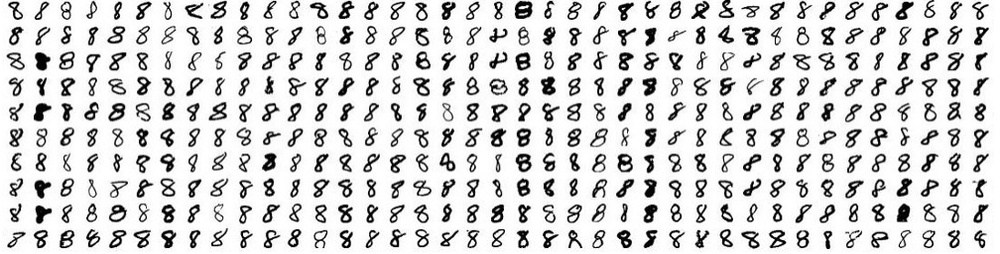
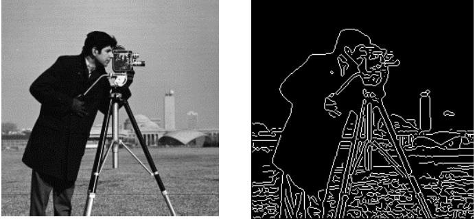

# Background

* Researchers complain about gene annotation
* Manual annottaion project generated a long list of "correct" gene annotations
* We want to bring neural networks to PFR vreeding
* Ling term view is to produce models that can support breeding decision making

---

# Aim of the project

* Long term view is to work with variant data to predict trait(s distributions)
* Make annotation better (do we need an NN?) 
* Structure detection
 * edge detection
 * convolutional networks
 * Unsupervised learning?
* Gene prediction
 * supported by what data? 

---

# Step one detection 

---

# Step two detection 2

---

# Step three: edge detection

