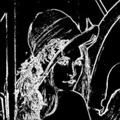

# Background

* Researchers complain about gene annotation
* Manual annottaion project generated a long list of "correct" gene annotations
* We want to bring neural networks to PFR vreeding
* Ling term view is to produce models that can support breeding decision making

---

# Aim of the project

* Long term view is to work with variant data to predict trait(s distributions)
* Make annotation better 
* Use manual annotation data

---

# hmhm

---

# hmhm

---

# hmhm

---

# hmhm

