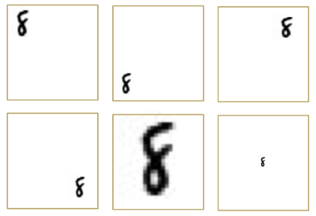

# Background

* Researchers complain about gene annotation
* Manual annottaion project generated a long list of "correct" gene annotations
* We want to bring neural networks to PFR vreeding
* Ling term view is to produce models that can support breeding decision making
* Long term view is to work with variant data to predict trait(s distributions)
* Make annotation better (do we need an NN?) 

---

# The Idea

---

# Augustus Worked

---

# Bummer!

---

# Steps

* QC on and collection of data
* Proof of concept
 * Detect gene
 * Edge detection
* Unspervised learning?

---

# Step one detection 

---

# Step two detection 2

---

# Step three: edges

